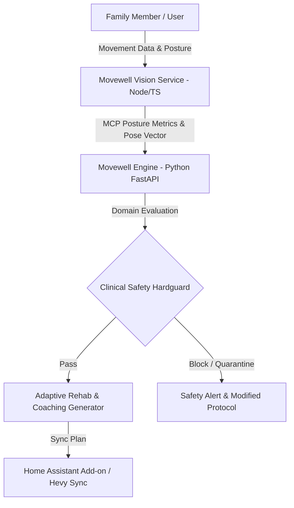

# Movewell Family System Architecture

## Architectural Overview

Movewell Family is designed as a decoupled, privacy-centric open-source movement health and physical rehabilitation platform. It combines a Python FastAPI engine for clinical rules, family profile baselines, and safety hardguard validation with a Node.js/TypeScript vision service for real-time posture and movement metrics via Model Context Protocol (MCP).

## Core Components

### 1. Movewell Engine (`movewell_engine/`)
- **FastAPI Core**: Serves RESTful API endpoints and MCP-compliant JSON-RPC interfaces.
- **Family Profiles**: Manages multi-user family baselines, movement capabilities, historical fatigue, and active rehabilitation goals.
- **Clinical Safety Hardguards**: A non-bypassable, deterministic safety validation engine that evaluates exercise safety against user physical flags, recent pain reports, and fatigue metrics.

### 2. Movewell Vision (`movewell_vision/`)
- **TypeScript MCP Interface**: Exposes 20 standardized Model Context Protocol tools for camera stream ingestion, joint angle calculation, posture deviation analysis, and movement quality scoring.
- **Real-Time Analysis**: Processes joint keypoints to compute lumbar flexion, neck tilt, and shoulder symmetry metrics in real time.

### 3. Home Assistant Integration (`deploy/`)
- **Containerized Add-on**: Packageable as a official Home Assistant Add-on using Docker and `config.yaml`.
- **Sensors & Dashboard**: Publishes family daily readiness scores, movement balance metrics, and rehabilitation compliance to Home Assistant sensors.

## Safety & Hardguard Policy
- **Deterministic Pre-conditions**: Soft AI LLM proposals never bypass deterministic clinical rules. If a user reports joint inflammation or acute fatigue, high-impact movements are hard-blocked regardless of prompt instructions.
- **Privacy Boundary**: Video streams are processed locally in memory; only numerical pose vectors and joint metrics leave the vision container.
